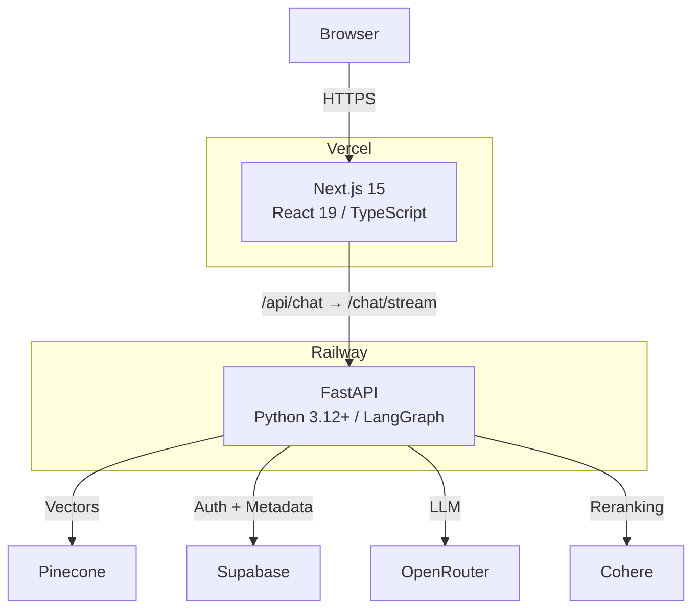
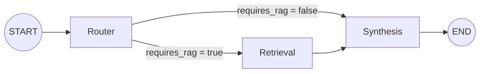
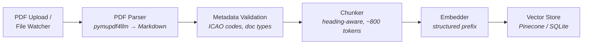
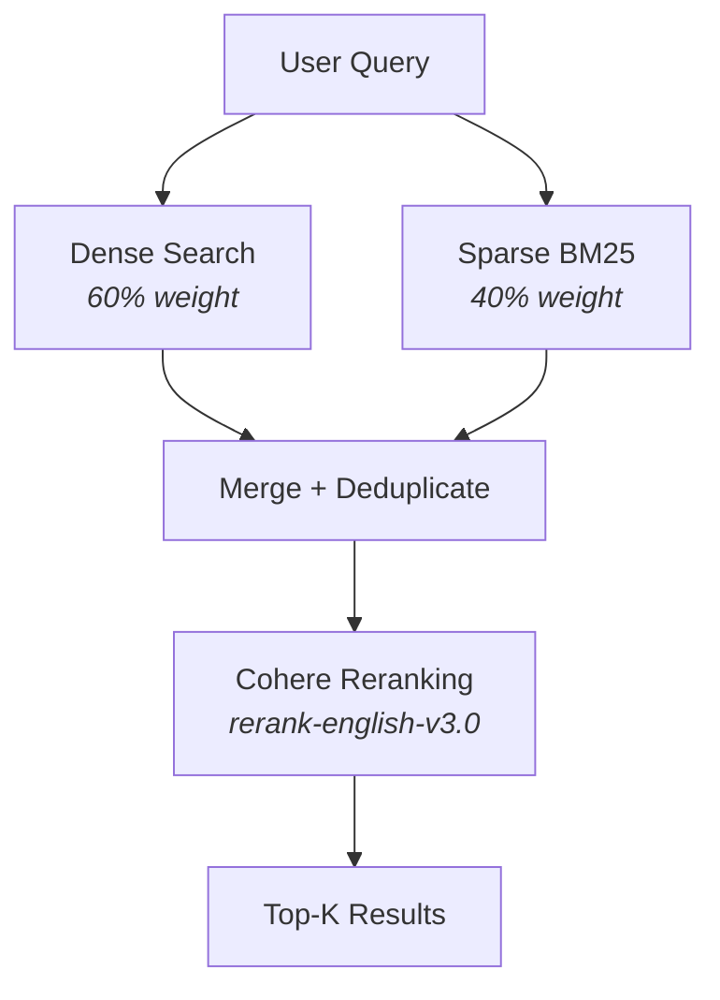
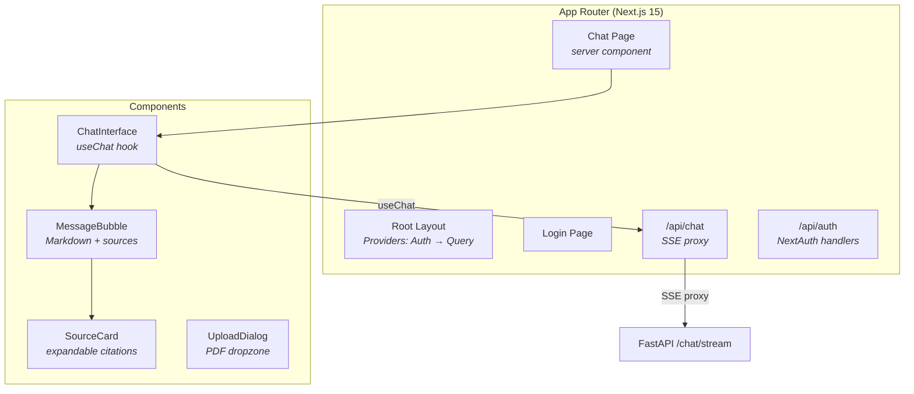
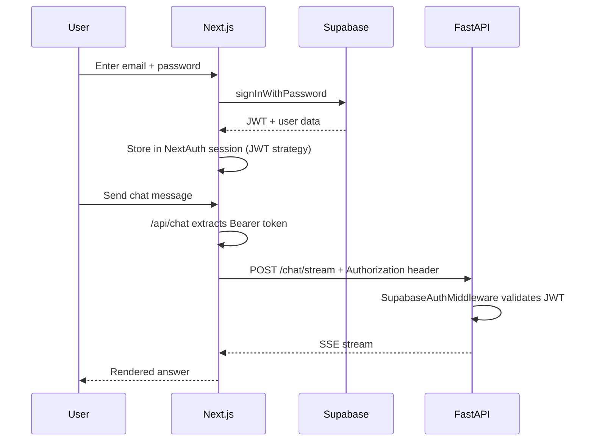
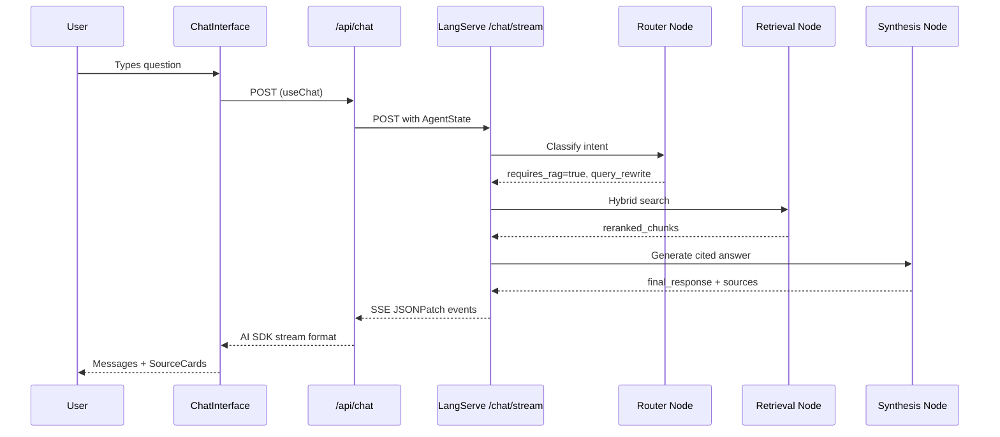

# Architecture

Celestia Memoria is an aviation regulatory document intelligence platform that uses Retrieval-Augmented Generation (RAG) to help air traffic controllers query ICAO, EASA, and local aerodrome documents through a chat interface.

## System Overview



**Monorepo structure:**

```
celestia-memoria/
├── apps/web/                Next.js 15 frontend (TypeScript, React 19, Tailwind CSS)
├── packages/shared-types/   Shared TypeScript type definitions
├── services/ai-backend/     FastAPI backend (Python 3.12+, LangGraph)
└── data/                    User-supplied aviation regulatory PDFs
```

## Agent Graph (LangGraph)

The core of the backend is a LangGraph state machine that routes queries through specialized nodes.



| Node | Model | Responsibility |
|------|-------|---------------|
| **Router** | Gemini Flash (fast) | Classify intent, decide if RAG needed, rewrite query for retrieval |
| **Retrieval** | — | Hybrid dense+sparse search, aerodrome filtering, Cohere reranking |
| **Synthesis** | Claude Sonnet (powerful) | Generate answer with `[Source N]` citations, strict grounding rules |

**AgentState** fields passed between nodes:

```python
messages            # Conversation history (LangChain format)
intent              # Classified query intent (from router)
requires_rag        # Whether document retrieval is needed
query_rewrite       # Optimized query for retrieval
retrieved_chunks    # Raw retrieval results
reranked_chunks     # Results after Cohere reranking
final_response      # Synthesized answer text
sources             # Parsed source references
node_trace          # Ordered list of executed nodes
model_slug          # LLM model identifier
aerodrome_icao      # Target aerodrome for filtering
```

## Ingestion Pipeline



**Key details:**

- **PDF Parser**: PyMuPDF converts PDFs to structured Markdown preserving headings, tables, and lists.
- **Chunker**: Splits on headings first, then by token count (~800 tokens, tiktoken cl100k_base). Includes sentence-level overlap between chunks. Extracts regulatory clause IDs (e.g., `5.2.1.1`).
- **Embedding prefix**: Structured metadata prepended to each chunk before embedding:
  ```
  [DOC:ICAO_DOC|ICAO:GLOBAL|SEC:Chapter 5 > Visual Aids]
  ```
  This improves domain-specific retrieval by encoding document context into the vector.
- **Storage**: Pinecone in production (namespaced by aerodrome), SQLite with cosine similarity in local mode.

## Retrieval System



- **Alpha = 0.6**: 60% dense (semantic similarity) + 40% sparse (BM25 keyword matching). Aviation docs have specific terminology that benefits from keyword matching alongside semantic search.
- **Namespace filtering**: Queries both the aerodrome-specific namespace and `GLOBAL` namespace, then deduplicates by `chunk_id`.
- **Reranking**: Cohere `rerank-english-v3.0` (production) or score-based sort (local mode). Top-K default: 20 retrieved, top 10 after rerank.

## Frontend Architecture



- **Auth**: NextAuth 5 + Supabase (email/password, JWT strategy)
- **Chat**: `useChat` hook from AI SDK → `/api/chat` route → SSE proxy to FastAPI LangServe endpoint
- **UI**: Radix UI primitives wrapped with Tailwind CSS, `cn()` utility for class merging
- **State**: TanStack React Query for server state, React state for UI

## Authentication Flow



In local mode, the auth middleware is bypassed entirely. A dev user is injected with `user_id=dev-local-user` and `role=admin`.

## Data Flow: Query



## Local vs Production Mode

| Component | Local Mode | Production Mode |
|-----------|-----------|-----------------|
| Vector DB | SQLite (cosine similarity in Python) | Pinecone |
| Embeddings | sentence-transformers `all-MiniLM-L6-v2` | OpenAI `text-embedding-3-small` |
| LLM | Ollama (`llama3.2`) | OpenRouter (Claude Sonnet) |
| Router LLM | Ollama | OpenRouter (Gemini Flash) |
| Reranking | Score-based sort | Cohere `rerank-english-v3.0` |
| Auth | Bypassed (dev user, admin role) | Supabase JWT validation |
| Database | SQLite | Supabase (PostgreSQL) |
| BM25 | Local corpus file | Pinecone sparse vectors |

Toggle with `USE_LOCAL_MODE=true` in `services/ai-backend/.env`.

## Technology Stack

| Layer | Technology | Version |
|-------|-----------|---------|
| Frontend | Next.js, React, TypeScript | 15, 19, 5.9 |
| UI | Radix UI, Tailwind CSS, Lucide Icons | — |
| State | TanStack React Query, Vercel AI SDK | 5.x, 4.x |
| Auth | NextAuth + Supabase | 5 beta |
| Backend | FastAPI, Python | 0.115+, 3.12+ |
| Agent | LangGraph, LangServe | 0.4+, 0.3+ |
| Vectors | Pinecone / SQLite | 6.x |
| Embeddings | text-embedding-3-small / all-MiniLM-L6-v2 | — |
| LLM | OpenRouter / Ollama | — |
| Reranking | Cohere | 5.x |
| PDF | PyMuPDF / pymupdf4llm | — |
| Package Mgmt | pnpm (JS), uv (Python) | 9+, latest |
| Monitoring | Sentry | — |

## Key Design Decisions

1. **Hybrid retrieval over pure dense** — Aviation documents contain specific ICAO terminology, abbreviations, and clause numbers. BM25 keyword matching captures exact matches that semantic search alone would miss.

2. **Heading-aware chunking** — Regulatory documents have strict hierarchical structure (chapters, sections, subsections). Preserving this hierarchy in chunks ensures citations can reference exact locations.

3. **Structured embedding prefix** — Encoding `[DOC:type|ICAO:code|SEC:section]` into the embedding input improves retrieval for domain-filtered queries without requiring metadata-only filtering.

4. **LangGraph over simple chain** — Conditional routing (skip retrieval for greetings), easy to add new nodes (compliance checker, multi-turn), built-in state management and tracing.

5. **LangServe streaming** — Server-sent events enable real-time answer generation. The Next.js route translates LangServe JSONPatch format to AI SDK stream format.

6. **Dual-mode architecture** — Local mode with SQLite + Ollama enables development without API keys or cloud services. Same code paths, different backends.

7. **Monorepo with shared types** — `packages/shared-types/` is the single source of truth for API contracts, ensuring TypeScript frontend and Python backend stay in sync.
